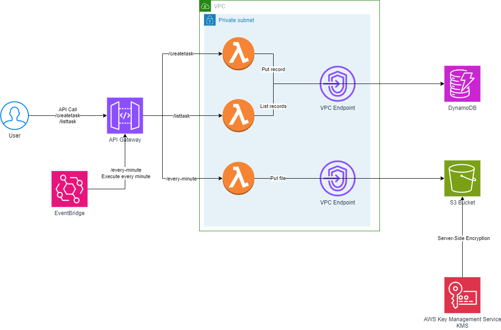

<!-- BEGIN_TF_DOCS -->
# nuwehack-cloud-tasker Terraform deployment

![LocalStack](https://img.shields.io/static/v1?label=Works&message=@LocalStack&color=purple&logo=data:image/png;base64,iVBORw0KGgoAAAANSUhEUgAAAEAAAABACAYAAACqaXHeAAAABHNCSVQICAgIfAhkiAAAAAlwSFlzAAAKgAAACoABZrFArwAAABl0RVh0U29mdHdhcmUAd3d3Lmlua3NjYXBlLm9yZ5vuPBoAAALbSURBVHic7ZpNaxNRFIafczNTGIq0G2M7pXWRlRv3Lusf8AMFEQT3guDWhX9BcC/uFAr1B4igLgSF4EYDtsuQ3M5GYrTaj3Tmui2SpMnM3PlK3m1uzjnPw8xw50MoaNrttl+r1e4CNRv1jTG/+v3+c8dG8TSilHoAPLZVX0RYWlraUbYaJI2IuLZ7KKUWCisgq8wF5D1A3rF+EQyCYPHo6Ghh3BrP8wb1en3f9izDYlVAp9O5EkXRB8dxxl7QBoNBpLW+7fv+a5vzDIvVU0BELhpjJrmaK2NMw+YsIxunUaTZbLrdbveZ1vpmGvWyTOJToNlsuqurq1vAdWPMeSDzwzhJEh0Bp+FTmifzxBZQBXiIKaAq8BBDQJXgYUoBVYOHKQRUER4mFFBVeJhAQJXh4QwBVYeHMQJmAR5GCJgVeBgiYJbg4T8BswYPp+4GW63WwvLy8hZwLcd5TudvBj3+OFBIeA4PD596nvc1iiIrD21qtdr+ysrKR8cY42itCwUP0Gg0+sC27T5qb2/vMunB/0ipTmZxfN//orW+BCwmrGV6vd63BP9P2j9WxGbxbrd7B3g14fLfwFsROUlzBmNM33XdR6Meuxfp5eg54IYxJvXCx8fHL4F3w36blTdDI4/0WREwMnMBeQ+Qd+YC8h4g78wF5D1A3rEqwBiT6q4ubpRSI+ewuhP0PO/NwcHBExHJZZ8PICI/e73ep7z6zzNPwWP1djhuOp3OfRG5kLROFEXv19fXP49bU6TbYQDa7XZDRF6kUUtEtoFb49YUbh/gOM7YbwqnyG4URQ/PWlQ4ASllNwzDzY2NDX3WwioKmBgeqidgKnioloCp4aE6AmLBQzUExIaH8gtIBA/lFrCTFB7KK2AnDMOrSeGhnAJSg4fyCUgVHsolIHV4KI8AK/BQDgHW4KH4AqzCQwEfiIRheKKUAvjuuu7m2tpakPdMmcYYI1rre0EQ1LPo9w82qyNziMdZ3AAAAABJRU5ErkJggg==)  

## Description

This repository deploys the Amazon Web Services resources for passing the `nuwehack-cloud-tasker` challenge. The resources deployed follows this architecture:



Where the user can call to the endpoints on the API Gateway for adding a record to the DynamoDB or getting all the records from the DynamoDB that are redirected to the Lambdas and also there is a timer where each minute the EventBridge sends a API Call to the API Gateway which redirects to a Lambda that creates a random file in a S3 bucket.

> [!WARNING]  
> A WAFv2 was intended to add to this architecture. However, _localstacks_ is not accepting this feature
> in the community version.

## How to use

This code is intended to be used with LocalStacks, is not tested with a real AWS environment.

For testing, install in your machine `docker`, `docker-compose`, `localstacks`, `terraform`, `jq`.

For getting up the `localstacks` environment, navigate to the root of this directory and execute in a shell:

```sh
docker-compose up
```
Then, open another shell, navigate to the folder `Infraestructure/Terraform` and execute the following:

```sh
terraform init
terraform plan
terraform apply --auto-approve
terraform output --json > out.json
```

Once it is finished, all the resources will be deployed in `localstacks`. For testing the endpoints, do the following:

- /createtask

``` sh
api_rest_api_id=$(cat out.json | jq -r '.api_rest_api_id.value')
curl -X POST "http://localhost:4566/restapis/${api_rest_api_id}/prod/_user_request_/createtask" -H 'Content-Type: application/json' -d'
{
  "task_name": "MyAwesomeTask",
  "cron_expression": "* * * * *"
}'
```

The response should be the following:

```JSON
{
    "status":"Task created"
}
```

- /listtask

``` sh
api_rest_api_id=$(cat out.json | jq -r '.api_rest_api_id.value')
curl -X GET "http://localhost:4566/restapis/${api_rest_api_id}/prod/_user_request_/listtask"
```

The response should be the following, where the `task_id` would be a random UUID:
```JSON
[
    {
        "task_name": "MyAwesomeTask",
        "cron_expression": "* * * * *",
        "task_id": "b43d22dc-841a-4207-b458-b391297f2c3c"
    }
]
```

- /every-minute

This endpoint must not be used by a user, but the EventBridge do. While we were testing the other endpoints, files in the S3 bucket were created. For listing the files, execute the following:

```sh
awslocal s3 ls s3://taskstorage
```

The response should be something like this:

```txt
2024-03-19 10:53:43          5 0031a2f9-c72a-4e3e-9507-cd2c9b3c0dcb.txt
2024-03-19 10:54:37          5 03802358-21b8-4995-b866-fba84857f8b0.txt
2024-03-19 10:55:42          5 076c4bf9-f1cf-4c80-a145-7fd022e4747d.txt
2024-03-19 10:56:38          5 07849be3-92a4-46c8-930f-b15de0bb20fd.txt
2024-03-19 10:57:41          5 0acbf906-4a2f-4a4f-9089-c719a6f603a7.txt
```

## Requirements

| Name | Version |
|------|---------|
| <a name="requirement_terraform"></a> [terraform](#requirement\_terraform) | = 1.7.5 |

## Providers

| Name | Version |
|------|---------|
| <a name="provider_archive"></a> [archive](#provider\_archive) | 2.4.2 |
| <a name="provider_aws"></a> [aws](#provider\_aws) | 5.41.0 |
| <a name="provider_template"></a> [template](#provider\_template) | 2.2.0 |

## Modules

No modules.

## Resources

| Name | Type |
|------|------|
| [aws_api_gateway_deployment.taskapistageprod](https://registry.terraform.io/providers/hashicorp/aws/latest/docs/resources/api_gateway_deployment) | resource |
| [aws_api_gateway_integration.createtask-lambda](https://registry.terraform.io/providers/hashicorp/aws/latest/docs/resources/api_gateway_integration) | resource |
| [aws_api_gateway_integration.every-minute-lambda](https://registry.terraform.io/providers/hashicorp/aws/latest/docs/resources/api_gateway_integration) | resource |
| [aws_api_gateway_integration.listtask-lambda](https://registry.terraform.io/providers/hashicorp/aws/latest/docs/resources/api_gateway_integration) | resource |
| [aws_api_gateway_method.createtask](https://registry.terraform.io/providers/hashicorp/aws/latest/docs/resources/api_gateway_method) | resource |
| [aws_api_gateway_method.every-minute](https://registry.terraform.io/providers/hashicorp/aws/latest/docs/resources/api_gateway_method) | resource |
| [aws_api_gateway_method.listtask](https://registry.terraform.io/providers/hashicorp/aws/latest/docs/resources/api_gateway_method) | resource |
| [aws_api_gateway_resource.createtask](https://registry.terraform.io/providers/hashicorp/aws/latest/docs/resources/api_gateway_resource) | resource |
| [aws_api_gateway_resource.every-minute](https://registry.terraform.io/providers/hashicorp/aws/latest/docs/resources/api_gateway_resource) | resource |
| [aws_api_gateway_resource.listtask](https://registry.terraform.io/providers/hashicorp/aws/latest/docs/resources/api_gateway_resource) | resource |
| [aws_api_gateway_rest_api.task_apigw](https://registry.terraform.io/providers/hashicorp/aws/latest/docs/resources/api_gateway_rest_api) | resource |
| [aws_cloudwatch_event_api_destination.this](https://registry.terraform.io/providers/hashicorp/aws/latest/docs/resources/cloudwatch_event_api_destination) | resource |
| [aws_cloudwatch_event_connection.this](https://registry.terraform.io/providers/hashicorp/aws/latest/docs/resources/cloudwatch_event_connection) | resource |
| [aws_cloudwatch_event_rule.this](https://registry.terraform.io/providers/hashicorp/aws/latest/docs/resources/cloudwatch_event_rule) | resource |
| [aws_cloudwatch_event_target.this](https://registry.terraform.io/providers/hashicorp/aws/latest/docs/resources/cloudwatch_event_target) | resource |
| [aws_default_network_acl.default_network_acl](https://registry.terraform.io/providers/hashicorp/aws/latest/docs/resources/default_network_acl) | resource |
| [aws_default_security_group.default_security_group](https://registry.terraform.io/providers/hashicorp/aws/latest/docs/resources/default_security_group) | resource |
| [aws_dynamodb_table.task_table](https://registry.terraform.io/providers/hashicorp/aws/latest/docs/resources/dynamodb_table) | resource |
| [aws_iam_policy.LambdaPolicy](https://registry.terraform.io/providers/hashicorp/aws/latest/docs/resources/iam_policy) | resource |
| [aws_iam_policy.lambda_policy](https://registry.terraform.io/providers/hashicorp/aws/latest/docs/resources/iam_policy) | resource |
| [aws_iam_policy.this](https://registry.terraform.io/providers/hashicorp/aws/latest/docs/resources/iam_policy) | resource |
| [aws_iam_role.LambdaRole](https://registry.terraform.io/providers/hashicorp/aws/latest/docs/resources/iam_role) | resource |
| [aws_iam_role.this](https://registry.terraform.io/providers/hashicorp/aws/latest/docs/resources/iam_role) | resource |
| [aws_iam_role_policy_attachment.LambdaRolePolicy](https://registry.terraform.io/providers/hashicorp/aws/latest/docs/resources/iam_role_policy_attachment) | resource |
| [aws_iam_role_policy_attachment.iam_role_policy_attachment_lambda_vpc_access_execution](https://registry.terraform.io/providers/hashicorp/aws/latest/docs/resources/iam_role_policy_attachment) | resource |
| [aws_iam_role_policy_attachment.terraform_lambda_iam_policy_basic_execution](https://registry.terraform.io/providers/hashicorp/aws/latest/docs/resources/iam_role_policy_attachment) | resource |
| [aws_kms_alias.kms_alias](https://registry.terraform.io/providers/hashicorp/aws/latest/docs/resources/kms_alias) | resource |
| [aws_kms_key.kms_key](https://registry.terraform.io/providers/hashicorp/aws/latest/docs/resources/kms_key) | resource |
| [aws_lambda_function.CreateTaskHandler](https://registry.terraform.io/providers/hashicorp/aws/latest/docs/resources/lambda_function) | resource |
| [aws_lambda_function.ListTaskHandler](https://registry.terraform.io/providers/hashicorp/aws/latest/docs/resources/lambda_function) | resource |
| [aws_lambda_function.executeScheduledTaskHandler](https://registry.terraform.io/providers/hashicorp/aws/latest/docs/resources/lambda_function) | resource |
| [aws_lambda_permission.apigw-CreateTaskHandler](https://registry.terraform.io/providers/hashicorp/aws/latest/docs/resources/lambda_permission) | resource |
| [aws_lambda_permission.apigw-ListTaskkHandler](https://registry.terraform.io/providers/hashicorp/aws/latest/docs/resources/lambda_permission) | resource |
| [aws_lambda_permission.apigw-executeScheduledTaskHandler](https://registry.terraform.io/providers/hashicorp/aws/latest/docs/resources/lambda_permission) | resource |
| [aws_route_table.route_table_private](https://registry.terraform.io/providers/hashicorp/aws/latest/docs/resources/route_table) | resource |
| [aws_route_table_association.route_table_association_private](https://registry.terraform.io/providers/hashicorp/aws/latest/docs/resources/route_table_association) | resource |
| [aws_s3_bucket.taskstorage](https://registry.terraform.io/providers/hashicorp/aws/latest/docs/resources/s3_bucket) | resource |
| [aws_s3_bucket_policy.bucket_policy](https://registry.terraform.io/providers/hashicorp/aws/latest/docs/resources/s3_bucket_policy) | resource |
| [aws_s3_bucket_server_side_encryption_configuration.sse_config](https://registry.terraform.io/providers/hashicorp/aws/latest/docs/resources/s3_bucket_server_side_encryption_configuration) | resource |
| [aws_subnet.subnet_private](https://registry.terraform.io/providers/hashicorp/aws/latest/docs/resources/subnet) | resource |
| [aws_vpc.vpc](https://registry.terraform.io/providers/hashicorp/aws/latest/docs/resources/vpc) | resource |
| [aws_vpc_endpoint.dynamodb_vpce](https://registry.terraform.io/providers/hashicorp/aws/latest/docs/resources/vpc_endpoint) | resource |
| [aws_vpc_endpoint.s3_vpce](https://registry.terraform.io/providers/hashicorp/aws/latest/docs/resources/vpc_endpoint) | resource |
| [archive_file.createScheduledTask](https://registry.terraform.io/providers/hashicorp/archive/latest/docs/data-sources/file) | data source |
| [archive_file.executeScheduledTask](https://registry.terraform.io/providers/hashicorp/archive/latest/docs/data-sources/file) | data source |
| [archive_file.listScheduledTask](https://registry.terraform.io/providers/hashicorp/archive/latest/docs/data-sources/file) | data source |
| [aws_caller_identity.current](https://registry.terraform.io/providers/hashicorp/aws/latest/docs/data-sources/caller_identity) | data source |
| [aws_iam_policy_document.bucket_policy](https://registry.terraform.io/providers/hashicorp/aws/latest/docs/data-sources/iam_policy_document) | data source |
| [aws_iam_policy_document.s3_endpoint_policy](https://registry.terraform.io/providers/hashicorp/aws/latest/docs/data-sources/iam_policy_document) | data source |
| [template_file.lambdapolicy](https://registry.terraform.io/providers/hashicorp/template/latest/docs/data-sources/file) | data source |

## Inputs

No inputs.

## Outputs

| Name | Description |
|------|-------------|
| <a name="output_api_invoke_url"></a> [api\_invoke\_url](#output\_api\_invoke\_url) | API invoke url. |
| <a name="output_api_rest_api_id"></a> [api\_rest\_api\_id](#output\_api\_rest\_api\_id) | API rest api id. |
<!-- END_TF_DOCS -->